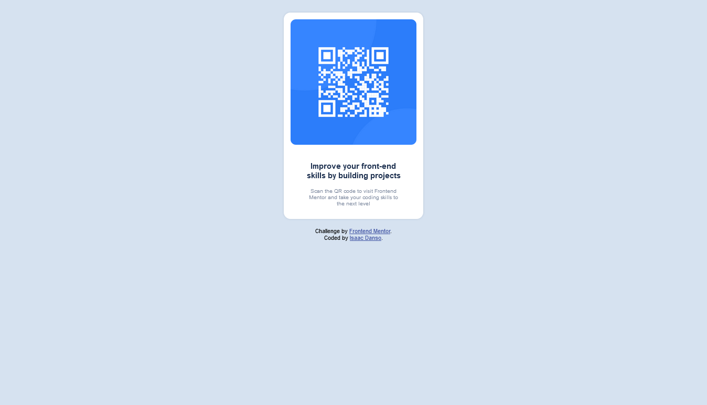
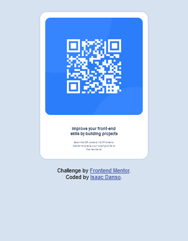

# Frontend Mentor - QR code component solution

This is a solution to the [QR code component challenge on Frontend Mentor](https://www.frontendmentor.io/challenges/qr-code-component-iux_sIO_H). Frontend Mentor challenges help you improve your coding skills by building realistic projects.

## Table of contents

- [Overview](#overview)
  - [Screenshot](#screenshot)
  - [Links](#links)
- [My process](#my-process)
  - [Built with](#built-with)
  - [What I learned](#what-i-learned)
  - [Continued development](#continued-development)
  - [Useful resources](#useful-resources)
- [Author](#author)
- [Acknowledgments](#acknowledgments)

## Overview

### Screenshot

**Desktop design**

**Mobile design**

### Links

- Solution URL: [Add solution URL here](https://your-solution-url.com)
- Live Site URL: [Add live site URL here](https://your-live-site-url.com)

## My process

### Built with

- Semantic HTML5 markup
- CSS custom properties
- Flexbox
- Mobile-first workflow

### What I learned

I learnt to apply border radius properties to the image and the figure,  
make the project responsive using media queries and how to apply color ot text,  
how to apply background image and styling with padding and margin properties

### Continued development

#Responsiveness

-I will want to continue to perfect my knowledge on the responsiveness of a page on multiple devices
-I will also continue to improve on writing better markdown for my projects

### Useful resources

-[MarkDown Guide](https://www.markdownguide.org) - This website helped me to understand what markdown was,  
the syntaxes used for writing markdown files and it's usefullness when attached to projects

## Author

- Website - [Isaaac Danso]()
- Frontend Mentor - [@Isaacohenedanso](https://www.frontendmentor.io/profile/isaacohenedanso)
